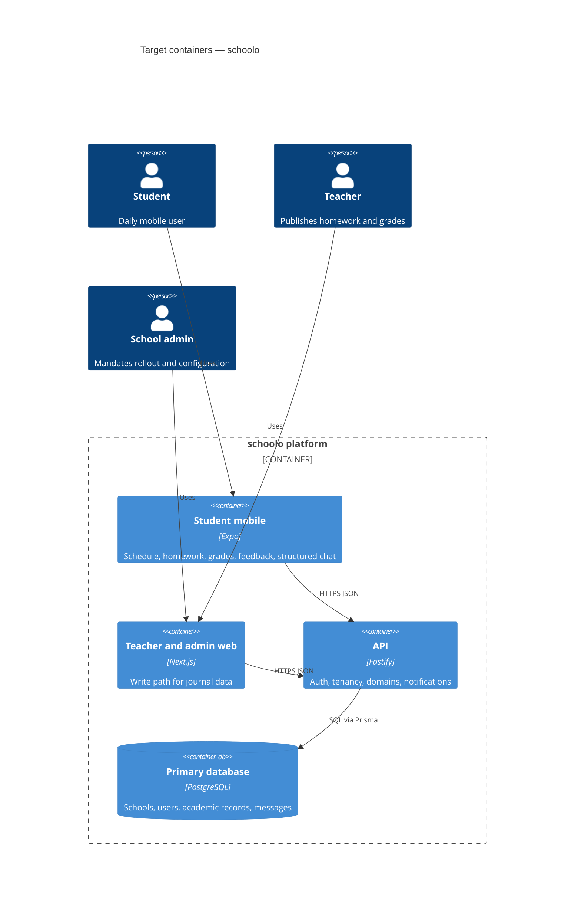

# Architecture map — schoolo

> **Target foundation** for a greenfield repo (`mode: greenfield-bootstrap`). Describes what
> `scaffold` will materialize. After scaffold, refresh `reflects_commit` if the layout drifts.
> Hand-maintained `docs/architecture.md`, if added later, is reconciled here — not replaced.

## Stack

- Language / runtime: TypeScript on Node.js 22 for the API and tooling; TypeScript for web and mobile apps (`docs/adr/0001-monorepo-and-typescript-stack.md`).
- Frameworks: Fastify (API), Next.js 15 App Router (teacher and admin web), Expo SDK (student iOS and Android).
- Data: PostgreSQL accessed through Prisma from the API (`docs/adr/0003-postgresql-prisma-persistence.md`).
- Monorepo: pnpm workspaces with shared packages (`docs/adr/0001-monorepo-and-typescript-stack.md`).
- Build / test / lint: root `pnpm build`, `pnpm test`, `pnpm lint` (wired in scaffold task S4).

## C4 — system as it is

## Module inventory

| Module | Path | Layers | Wired at | Responsibility |
|---|---|---|---|---|
| api | `apps/api` | domain → app → infra → ports per bounded context | `apps/api/src/server.ts` (scaffold) | HTTP API, auth, school tenancy, journal domains |
| web | `apps/web` | ui → app (server actions / client) | `apps/web/app/layout.tsx` (scaffold) | Teacher and admin web write path |
| mobile | `apps/mobile` | ui → app | `apps/mobile/app/_layout.tsx` (scaffold) | Student mobile read and lightweight write |
| shared | `packages/shared` | schemas + shared types | `packages/shared/src/index.ts` (scaffold) | Zod contracts shared by api, web, mobile |

Bounded contexts inside `apps/api` (folders under `apps/api/src/modules/`): `schools`, `users`, `schedule`, `homework`, `grades`, `feedback`, `messages` — each follows the hexagonal slice in ADR 0002.

## Conventions (cited — the rules a new feature must match)

- **Module wiring / registration:** Fastify plugins register one module per bounded context; routes bind to app services — `docs/adr/0002-hexagonal-module-layout.md`.
- **Error handling:** Problem Details (RFC 7807-style) JSON envelope from the API; clients map to user-visible messages — `docs/adr/0002-hexagonal-module-layout.md`.
- **IDs:** ULID strings generated in the application layer, stored as text — `docs/adr/0003-postgresql-prisma-persistence.md`.
- **Persistence / DB access:** Prisma client only in `infra` adapters; domain stays persistence-ignorant — `docs/adr/0002-hexagonal-module-layout.md`.
- **Migrations:** Prisma Migrate; one migration per schema change under `apps/api/prisma/migrations/` — `docs/adr/0003-postgresql-prisma-persistence.md`.
- **Tests:** Vitest unit tests colocated; integration tests hit ephemeral PostgreSQL (Docker) — `docs/adr/0001-monorepo-and-typescript-stack.md`.
- **Inter-module communication:** In-process calls within the API; no event bus in v1 foundation — `docs/adr/0002-hexagonal-module-layout.md`.
- **UI / styling:** Web uses Tailwind CSS with a shared token file; mobile uses NativeWind aligned to the same token names — `docs/adr/0001-monorepo-and-typescript-stack.md`.

## Datastores

| Store | Engine | Accessed via | Notes |
|---|---|---|---|
| Primary | PostgreSQL | Prisma in `apps/api` | Single database for v1; school_id on tenant-scoped tables |

## Frontend / UI foundation

- **Component library / design system:** shadcn/ui on web (`apps/web/components/ui/`); React Native Paper or custom primitives on mobile — established during first UI features.
- **Design tokens:** CSS variables in `apps/web/app/globals.css`; mirrored constants in `apps/mobile/theme/tokens.ts` — scaffold creates placeholders.
- **Styling approach:** Tailwind CSS (web); NativeWind (mobile) — `docs/adr/0001-monorepo-and-typescript-stack.md`.
- **Shared primitives:** Button, Input, Card patterns copied from shadcn on web; mobile composes matching semantics — added with first screens.
- **State / data-fetching:** TanStack Query on web and mobile; server state from API — convention doc in scaffold CLAUDE.md.
- **Closest UI precedent:** To be set after first teacher dashboard and student home screens ship.

## Where things live / closest precedents

- A new API capability → `apps/api/src/modules/<context>/` (domain, app, infra, ports), modelled on the module skeleton from scaffold.
- A new teacher or admin screen → `apps/web/app/(authenticated)/…`, composed from shadcn primitives.
- A new student screen → `apps/mobile/app/(tabs)/…`, using shared Zod types from `packages/shared`.

## Constraints & known tech-debt

- **Greenfield — skeleton not materialized yet** — run `/sdd:scaffold` before feature implementation; machine keys assume pnpm scripts exist after scaffold.
- **Single-region v1** — no multi-region or offline-first mobile in the foundation.
- **AI assistant** — not part of the scaffold; added as a later module consuming read-only aggregates from existing domains (per product brief).

## Reconciliation with the authored architecture doc

No authored architecture doc; this map is the current reference. Product intent lives in `docs/idea-brief.md`.
