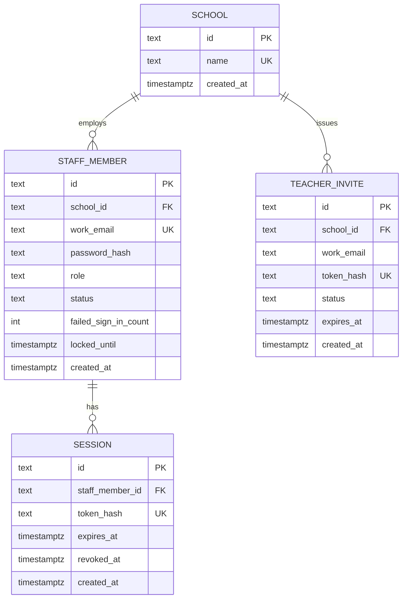

# Data model — school-auth

## ER diagram

## Entities

### `schools` (existing — expand)

| Column | Type | Constraints | Notes |
|---|---|---|---|
| `id` | TEXT | PK, app ULID | existing |
| `name` | TEXT | NOT NULL, UNIQUE | school display name (spec); existing column kept |
| `created_at` | TIMESTAMPTZ | NOT NULL DEFAULT now() | existing |

**Aggregate root:** School (root).  
**Access patterns:** lookup by display name on register → `schools_name_key`.  
**Constraints:** UNIQUE(`name`).

### `staff_members`

| Column | Type | Constraints | Notes |
|---|---|---|---|
| `id` | TEXT | PK, app ULID | |
| `school_id` | TEXT | NOT NULL, FK → schools(id) | tenant |
| `work_email` | TEXT | NOT NULL, UNIQUE | global one-school rule |
| `password_hash` | TEXT | NOT NULL | hashed secret; never plaintext |
| `role` | TEXT | NOT NULL | `school_admin` \| `teacher` |
| `status` | TEXT | NOT NULL | `active` \| `inactive` |
| `failed_sign_in_count` | INTEGER | NOT NULL DEFAULT 0 | lockout counter |
| `locked_until` | TIMESTAMPTZ | NULL | null when not locked |
| `created_at` | TIMESTAMPTZ | NOT NULL DEFAULT now() | |

**Aggregate root:** StaffMember (root).  
**Access patterns:** sign-in by work_email → unique; roster by school_id → `staff_members_school_id_idx`.  
**Constraints:** UNIQUE(`work_email`); FK `school_id` → `schools(id)`; single School Admin enforced in app (not DB CHECK — repo has no CHECK pattern).

### `teacher_invites`

| Column | Type | Constraints | Notes |
|---|---|---|---|
| `id` | TEXT | PK, app ULID | |
| `school_id` | TEXT | NOT NULL, FK → schools(id) | |
| `work_email` | TEXT | NOT NULL | invitee |
| `token_hash` | TEXT | NOT NULL, UNIQUE | hash of invite secret in link |
| `status` | TEXT | NOT NULL | `pending` \| `expired` \| `used` \| `invalid` |
| `expires_at` | TIMESTAMPTZ | NOT NULL | 14-day validity |
| `created_at` | TIMESTAMPTZ | NOT NULL DEFAULT now() | |

**Aggregate root:** School owns invite rows by FK; **users** module manages lifecycle (pending before StaffMember exists).  
**Access patterns:** accept by token_hash → unique; duplicate invite check by school_id + work_email + status; list roster invites by school_id.  
**Constraints:** UNIQUE(`token_hash`); FK `school_id` → `schools(id)`.

### `sessions`

| Column | Type | Constraints | Notes |
|---|---|---|---|
| `id` | TEXT | PK, app ULID | |
| `staff_member_id` | TEXT | NOT NULL, FK → staff_members(id) | |
| `token_hash` | TEXT | NOT NULL, UNIQUE | HTTP-only cookie maps here |
| `expires_at` | TIMESTAMPTZ | NOT NULL | |
| `revoked_at` | TIMESTAMPTZ | NULL | set on logout/revoke |
| `created_at` | TIMESTAMPTZ | NOT NULL DEFAULT now() | |

**Aggregate root:** StaffMember.  
**Access patterns:** resolve cookie by token_hash → unique; revoke-all by staff_member_id → `sessions_staff_member_id_idx`.  
**Constraints:** UNIQUE(`token_hash`); FK `staff_member_id` → `staff_members(id)` ON DELETE CASCADE.

## Indexes

| Index | Columns | Query it serves |
|---|---|---|
| `schools_name_key` | UNIQUE (`name`) | Register school — lookup/conflict by display name |
| `staff_members_pkey` | PK (`id`) | session → staff load |
| `staff_members_work_email_key` | UNIQUE (`work_email`) | Sign in; global one-school rule; accept invite cross-school check |
| `staff_members_school_id_idx` | (`school_id`) | Staff roster by school; FK |
| `teacher_invites_token_hash_key` | UNIQUE (`token_hash`) | Accept invite by link token |
| `teacher_invites_school_id_idx` | (`school_id`) | Roster pending/expired invites; FK |
| `teacher_invites_school_email_status_idx` | (`school_id`, `work_email`, `status`) | Invite teacher duplicate pending/active check |
| `sessions_token_hash_key` | UNIQUE (`token_hash`) | Authenticated request session resolve |
| `sessions_staff_member_id_idx` | (`staff_member_id`) | Revoke — invalidate all sessions; FK |

## Test fixtures

Not in migrations. Prefer factories colocated with API tests (Vitest), e.g.:

- `makeSchool({ name: "Pilot School" })` — ULID id, no PII.
- `makeStaffMember({ role: "school_admin", workEmail: "admin@example.test" })`.
- `makeTeacherInvite({ workEmail: "teacher@example.test" })`.
- `makeSession({ staffMemberId })`.

Emails only `@example.test`.

## Staged migrations

Pairs under `docs/features/school-auth/migrations/` (feature-local ordinals). **Not** in `apps/api/prisma/migrations/` until `implement` promotes them.

Promote-time hint: Prisma Migrate timestamp folders after `20260203120000_init`; `implement` assigns the real timestamp and updates `schema.prisma`.
