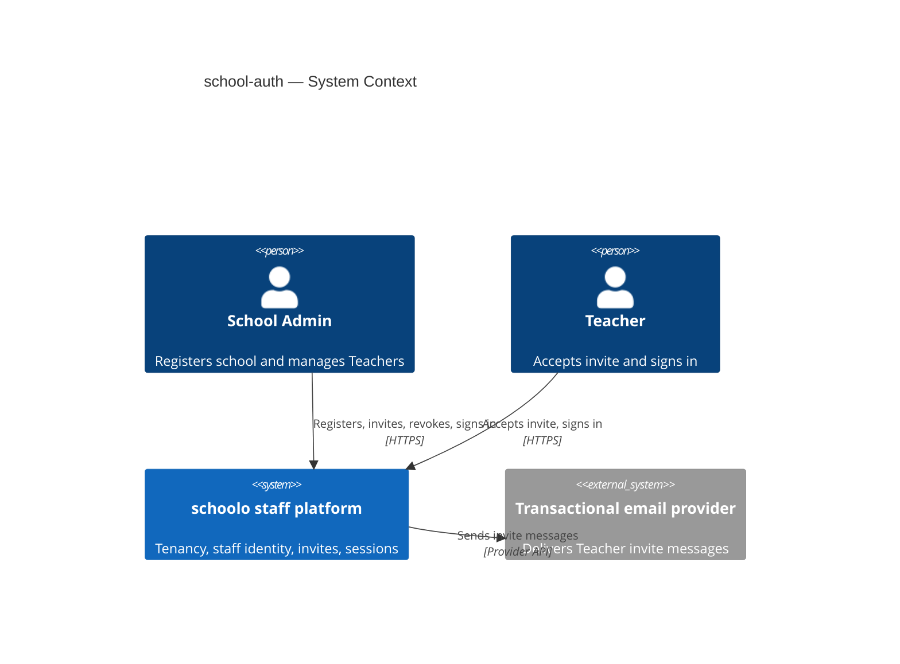
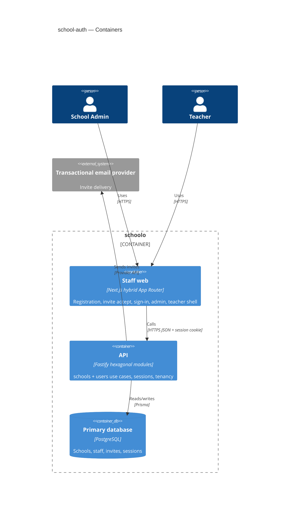
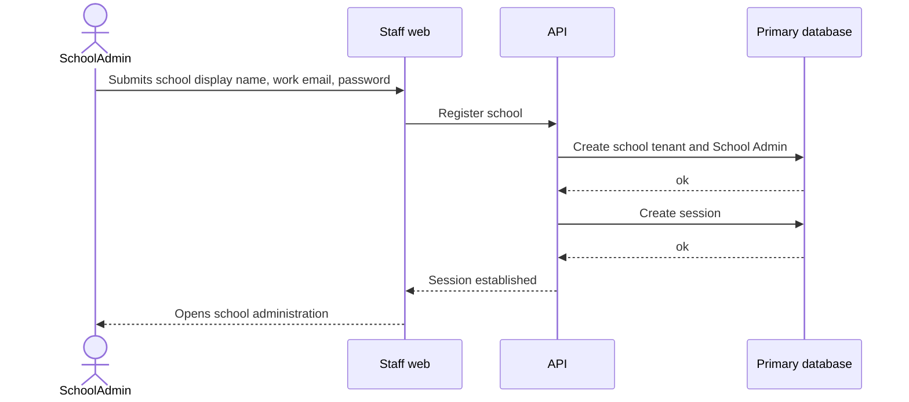
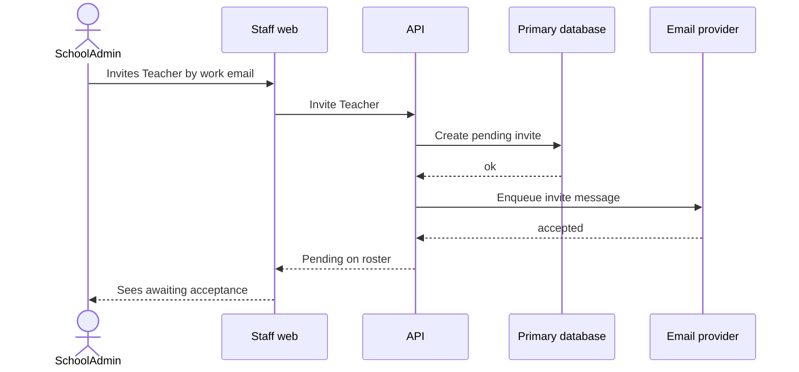

# Software Architecture Document — school-auth

## 1. Introduction and goals

**Intent.** school-auth lets a School Admin self-register an isolated school tenant, invite Teachers by work email, and lets both roles sign in on the staff web app with school-scoped authorization — the staff-identity foundation before schedule, homework, or grades.

**Top-3 quality goals (1-liners; full scenarios in §10):**

1. **Tenant isolation** — staff of school A never see school B administration or roster data.
2. **Auth reliability for pilot onboarding** — registration and sign-in meet agreed p95 latency; invite email is enqueued reliably.
3. **Immediate access revocation** — revoked Teachers lose workspace access on the next request after revoke.

**Stakeholders.**

| Role | Interest | Sign-off owner? |
|---|---|---|
| School Admin | Registers school, invites and revokes Teachers | No |
| Teacher | Accepts invite, signs in to teacher workspace | No |
| Tech Lead | SAD approval | Yes |
| Security Lead | Auth boundary and PII review | Yes |

**Decision overrides**
- Decision override: Immediate session kill on Teacher revoke — rationale: design hardens beyond AC-09 (subsequent sign-in only) so a revoked Teacher cannot keep using an existing session; server-side session is invalidated on revoke.

## 2. Constraints

**Technical.**
- TypeScript on Node.js 22; Fastify API; Next.js 15 App Router web (`docs/architecture-map.md`).
- PostgreSQL via Prisma Migrate; ULID string IDs in the application layer.
- Hexagonal modules under `apps/api/src/modules/<context>/` (domain → app → infra → ports).
- Problem Details-style API errors; shared Zod types in `packages/shared`.

**Organisational.**
- Feature size M (~1–2 sprints); route `standard`.
- Pilot-first: single region; no platform-operator console in this slice.
- No `ux-flows.md` yet — screen inventory deferred to `/sdd:ux-flows school-auth` (or screens later).

**Conventions.**
- `CLAUDE.md` + foundational ADRs 0001–0003 at repo `docs/adr/`.
- Feature ADRs under `docs/features/school-auth/adr/`.

**Regulatory / external.**
- Staff personal data (names, work emails, credentials) classified confidential (spec §6.1).
- Geography / child-data rules for later chat/parent AI remain product open questions outside this feature.

## 3. Context and scope

Staff create and join a school tenant through the schoolo staff web app. The API is the trust boundary for tenancy, credentials, invites, and sessions. A transactional email provider delivers Teacher invite messages. Students, parents, and mobile apps are outside this feature’s scope.

<!-- brownfield: scaffolded monorepo with API health, Prisma schools stub, Next.js/Expo placeholders; journal modules empty (architecture-map reflects c6e2691, HEAD later) -->

**External systems (in / out):**

| Actor or system | Type | Interaction |
|---|---|---|
| School Admin | Person | Registers school, manages staff roster, signs in |
| Teacher | Person | Accepts invite, signs in to teacher workspace |
| schoolo platform (API + staff web) | System (ours) | Auth, tenancy, invites, sessions |
| Transactional email provider | System (external) | Sends Teacher invite emails |
| Student mobile / Parent | Out of scope | Not actors in this feature |

**C4 Context (L1):**



## 4. Solution strategy

**Top strategic choices (the seeds for ADRs):**

1. **Own backend-service and web-frontend** — Staff complete the full loop in this feature; mobile deferred (ADR 0001).
2. **Hybrid Next.js App Router for staff UI** — Server path for auth forms; client for roster interactivity (ADR 0002).
3. **HTTP-only cookie + server-side sessions** — Instant logout/revoke and SSR-friendly auth (ADR 0003).
4. **Email behind a port** — Invite lifecycle in domain; provider swappable (ADR 0004).
5. **`schools` + `users` modules** — Tenant vs staff identity/sessions/invites (ADR 0005).

## 5. Building block view

Hexagonal modules in the API; staff web as a separate container consuming the API. Registration is an app use case that coordinates `schools` (create tenant) and `users` (create School Admin + session). Invites, credentials, sessions, and roster live in `users`. Tenancy checks (`school_id` + role) run on every authenticated staff action.

**Internal decomposition:**

```
apps/api/src/modules/
├── schools/
│   ├── domain/     School tenant rules (unique display name)
│   ├── app/        RegisterSchool, tenancy queries
│   ├── infra/      Prisma adapters
│   └── ports/      HTTP handlers
└── users/
    ├── domain/     Staff identity, invite lifecycle, session rules
    ├── app/        InviteTeacher, AcceptInvite, SignIn, Revoke, Roster
    ├── infra/      Prisma + EmailPort adapter + session store
    └── ports/      HTTP handlers
apps/web/app/
├── (public)/       register, sign-in, accept-invite
└── (authenticated)/ school-admin/, teacher/
```

**C4 Container (L2):**



## 6. Runtime view

**Critical flow 1: Register school**



**Critical flow 2: Invite Teacher**



Seed flows only — `/sdd:sequences school-auth` covers remaining ACs.

## 7. Deployment view

Single-region pilot: API and staff web deploy as the existing monorepo apps; PostgreSQL is the primary store; email provider is an external SaaS. No new worker process in v1 — invite send is synchronous enqueue from the API request path (provider accepts quickly).

**Monitoring:**
- Metrics — registration success/failure, invite enqueue success, sign-in success/failure, lockout events, cross-tenant denial count
- Alerts — invite enqueue failure rate spike; registration rate-limit trips; any successful cross-tenant staff data view
- Tracing — spans on register, invite, accept, sign-in, revoke

**Scaling thresholds:**
- Comfortable for one pilot school’s staff counts in a single Postgres instance
- Revisit session-store partitioning only if concurrent staff sessions grow beyond pilot scale

## 8. Crosscutting concepts

| Concept | Convention | Where defined |
|---|---|---|
| Logging | Structured logs with `school_id`, `staff_id`, module name; never log passwords or raw invite tokens | CLAUDE.md + here |
| Authentication | HTTP-only session cookie; server-side session rows | ADR 0003 |
| Authorization | Every staff action checks school membership + role (School Admin vs Teacher) | spec §6.1 / here |
| Error handling | Domain errors → Problem Details JSON; web maps to plain language | architecture-map / ADR 0002 (repo) |
| ID strategy | ULID strings in app layer | docs/adr/0003 |
| Internationalisation | N/A — single language in pilot | — |
| Observability | Request-boundary tracing on auth use cases | §7 |
| Email | Outbound only via EmailPort | ADR 0004 |
| Rate limiting | Registration per contact domain; failed sign-in lockout | §10 / spec §6.1 |

## 9. Architecture decisions

| # | Title | Status | Section |
|---|---|---|---|
| 0001 | Own backend-service and web-frontend surfaces for school-auth | Accepted | §4 |
| 0002 | Use hybrid Next.js App Router for staff UI | Accepted | §4 |
| 0003 | Use HTTP-only cookie with server-side sessions | Accepted | §4 |
| 0004 | Send invites via email port and transactional provider | Accepted | §3 |
| 0005 | Split API into schools and users modules | Accepted | §5 |

ADR files live under `docs/features/school-auth/adr/`.

## 10. Quality requirements

Numbers from spec §6 NFR (updated in design for former TBD latency rows):

**QG-1. Tenant isolation**
- **When:** authenticated staff of school A attempt to view or change school B administration
- **Then:** access is denied with a plain-language message and no school B data is shown (spec AC-11); unauthorized cross-school access attempts target 0 confirmed breaches (spec §7)
- **How verify:** integration tests for cross-tenant denial; audit alert on successful cross-tenant view

**QG-2. Auth reliability for pilot onboarding**
- **When:** School Admin completes registration (including invite-path email enqueue on later invites) or staff sign in
- **Then:** p95 school registration ≤ 2s; p95 staff sign-in ≤ 500ms; auth availability 99.5% monthly; invite completion ≥ 70% within 7 days (spec §6)
- **How verify:** latency metrics in staging load smoke; production auth success rate; invite→active Teacher analytics

**QG-3. Immediate access revocation**
- **When:** School Admin revokes an active Teacher
- **Then:** Teacher appears inactive on roster and cannot open teacher workspace on subsequent requests (spec AC-09); session invalidated server-side
- **How verify:** integration test revoke → next authenticated request denied; session row removed or marked invalid

## 11. Risks and technical debt

| Risk / debt | Severity | Mitigation | Owner |
|---|---|---|---|
| Undelivered invite email blocks Teacher activation | High | EmailPort with retries; reissue invite (AC-13); monitor enqueue failures | Tech Lead |
| Self-serve fake schools | Medium | Rate limit 5 registrations/hour per contact domain; ops alert; create tenant (no hold) | Security Lead |
| Credential stuffing | Medium | Lockout after 5 failed sign-ins / 15 min; plain lock message | Security Lead |
| Architecture map stale vs HEAD | Low | Re-run survey after auth lands | Architect |
| No ux-flows.md yet | Medium | Run `/sdd:ux-flows school-auth` before screens | PM |

**Accepted debt (acceptable in v1, plan to fix later):**
- Single School Admin; no co-admin invites
- No MFA
- Email provider chosen at deploy time; logging adapter acceptable in local/dev
- Session store in primary Postgres (no dedicated session cache)

## 12. Glossary

| Term | Meaning |
|---|---|
| School Admin | Single staff member who registers the school and manages Teachers (see CONTEXT.md) |
| Teacher | Staff member activated via invite for one school |
| School (tenant) | Isolated organization boundary; unique display name |
| Work email | Valid deliverable email; at most one active school membership |
| Teacher invite | Pending invitation; expires after 14 days; reissue creates a new invite |
| Staff roster | Teachers with status pending / active / expired / inactive |
| School administration | Post-sign-in UI for School Admin |
| Teacher workspace | Post-sign-in UI for Teacher |
| Session | Server-side login state bound to HTTP-only cookie |

## Design edits-log

- §4 target_surfaces · approved · backend-service + web-frontend → ADR 0001
- §4 web UI · approved · hybrid App Router → ADR 0002
- §4 sessions · approved · cookie + server session → ADR 0003
- §3 email · approved · EmailPort + provider → ADR 0004
- §5 modules · approved · schools + users → ADR 0005
- §10 NFR · approved · p95 2s / 500ms; rate limits 5/h domain; lockout 5/15m
- critic F1 · override · immediate revoke vs AC-09 → §1 Decision overrides
- critic F6 · amendment · ADR 0004 email latency wording fixed to invite path
