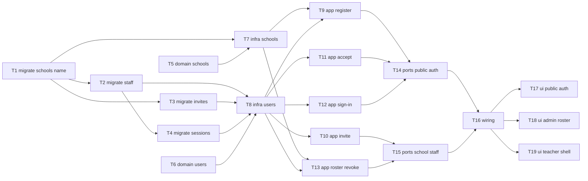

# Epic — school-auth

> **Spec:** [spec.md](../spec.md) · **Design:** [sad.md](../sad.md) · **Data model:** [data-model.md](../data-model.md) · **API:** [openapi.yaml](../contracts/openapi.yaml) · **ADRs:** [adr/](../adr/) · **Screens:** [screens.md](../screens.md)

## Goal

Ship the staff-identity foundation: a School Admin self-registers an isolated school tenant, invites Teachers by work email, and both roles sign in on the staff web app with school-scoped sessions — before schedule, homework, or grades.

## Scope

- **In:** API modules `schools` + `users` (migrations → domain → infra → app → ports → wiring), staff web (`web-frontend`) screens SCR-01…05, EmailPort, cookie sessions.
- **Out:** Students/classes/enrollments, parents, SSO, platform-operator console, multi-admin, mobile student auth (spec §3).

## Task map

## Tasks

See [tracker.md](./tracker.md) for status. Machine contract: [tasks.json](../tasks.json).

| # | Task | Layer | Blocked by | DoD (short) |
|---|---|---|---|---|
| T1 | Promote unique schools.name migration | migration | — | Staged 01 pair promoted; UNIQUE(schools.name) applies and reverts cleanly. |
| T2 | Promote staff_members table migration | migration | T1 | staff_members table with global unique work_email applies and reverts cleanly. |
| T3 | Promote teacher_invites table migration | migration | T1 | teacher_invites table with token_hash UNIQUE applies and reverts cleanly. |
| T4 | Promote sessions table migration | migration | T2 | sessions table with token_hash UNIQUE and staff_member FK applies and reverts cleanly. |
| T5 | Implement School domain unique-name rules | domain | — | Unit tests prove duplicate display-name invariant without Prisma. |
| T6 | Implement staff, invite, and session domain rules | domain | — | Unit tests cover invite lifecycle, password min length, lockout counters, and revoke session invalidation rules. |
| T7 | Wire schools Prisma repository adapter | infra | T1, T5 | Integration or repo test: create school + conflict on duplicate name. |
| T8 | Wire users Prisma repos and EmailPort adapter | infra | T2, T3, T4, T6 | Repo tests for staff/invite/session CRUD; EmailPort logging adapter records invite send without live SMTP. |
| T9 | Implement RegisterSchool use case | app | T7, T8 | Unit/app tests: happy register creates school+admin+session; validation and name_taken fail as specified; rate limit 5/hour/domain. |
| T10 | Implement InviteTeacher and ReissueInvite use cases | app | T8 | App tests: pending invite + EmailPort call; duplicate blocked; reissue invalidates prior and creates new pending. |
| T11 | Implement AcceptInvite use case | app | T8 | App tests: accept activates teacher+session; expired/used blocked; email-elsewhere blocked (AC-06b/AC-12). |
| T12 | Implement SignIn use case with lockout | app | T8 | App tests: active staff session; generic auth.denied; lockout after 5 failures for 15 minutes. |
| T13 | Implement roster, revoke, and tenancy checks | app | T7, T8 | App tests: revoke inactivates teacher and sessions; Teacher forbidden on invite/revoke; cross-school access denied with no foreign data. |
| T14 | Expose register, sign-in, and accept-invite HTTP ports | ports | T9, T11, T12 | HTTP smoke/contract tests: registerSchool/signIn/acceptInvite status codes and error codes match OpenAPI; Set-Cookie on success. |
| T15 | Expose invite, reissue, roster, and revoke HTTP ports | ports | T10, T13 | HTTP tests: CookieAuth required; School Admin succeeds; Teacher gets staff.forbidden; cross-school school.forbidden. |
| T16 | Compose DI, session cookie middleware, and route registration | wiring | T14, T15 | Booted API resolves session from HTTP-only cookie; revoked session rejected on next request; modules wired without circular imports. |
| T17 | Build public register, sign-in, and accept-invite screens | ui | T16 | SCR-01/02/03 states (default/loading/validation/error/success redirects) work against API; hybrid server actions set cookies. |
| T18 | Build school administration staff roster screen | ui | T16 | SCR-04 states: roster load, empty, invite/reissue/revoke success, forbidden errors — School Admin only. |
| T19 | Build teacher workspace shell placeholder | ui | T16 | SCR-05 default/loading/error (revoked session) shell; Teachers land here after accept/sign-in. |

## Risks / Hard rules

- Tenant isolation on every authenticated staff action (`sad.md` §5 / AC-11).
- Immediate revoke via server-side sessions (ADR 0003 / AC-09).
- Invite email behind EmailPort (ADR 0004); logging adapter OK in local/dev.
- Registration rate limit ≤5/hour/domain; lockout 5 failures / 15 min (`spec.md` §6).
- Password minimum 12 characters; no MFA in this feature (`spec.md` §6.1).
- Do not invent UI beyond `screens.md` SCR states; design-system absent → shadcn NEW components.
