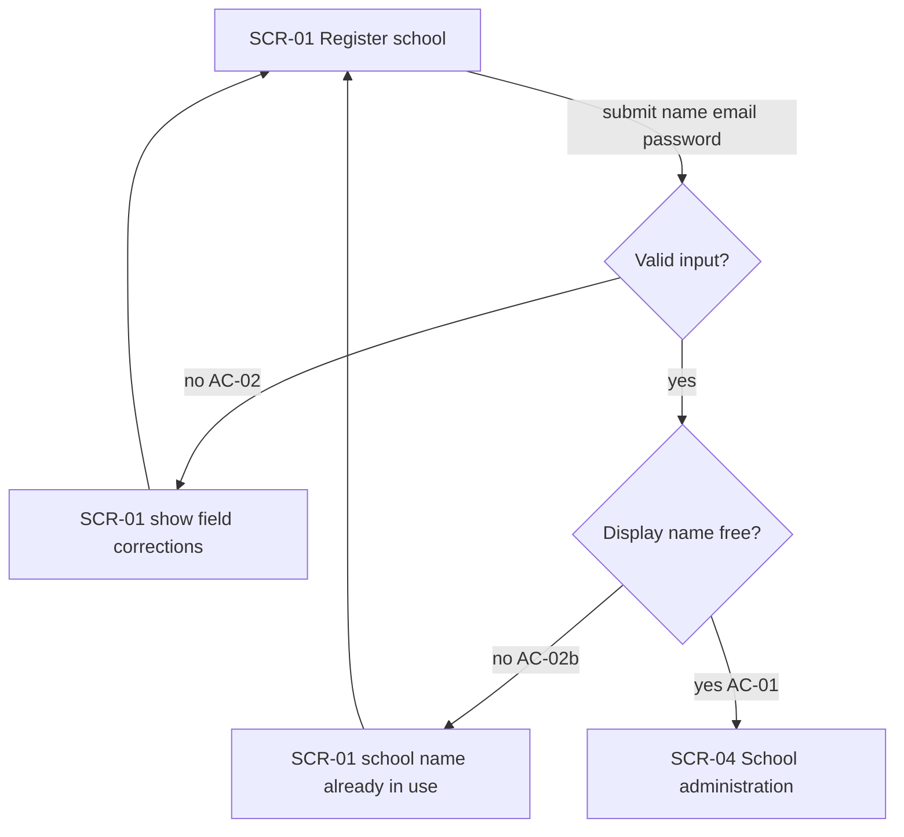
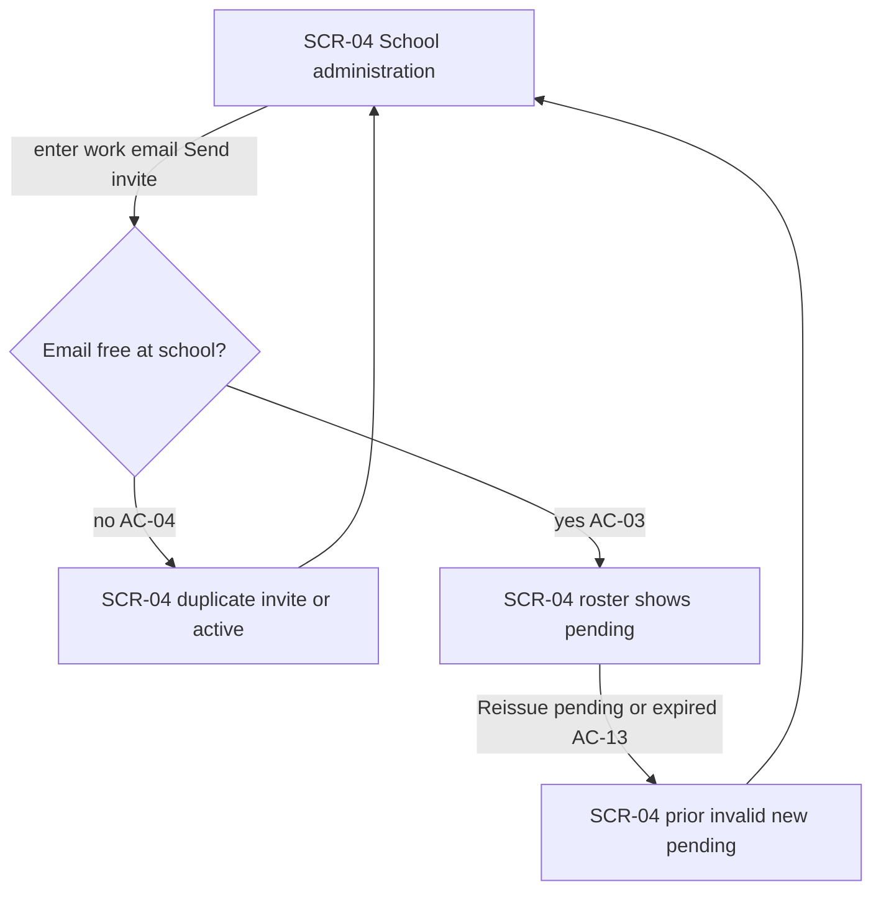
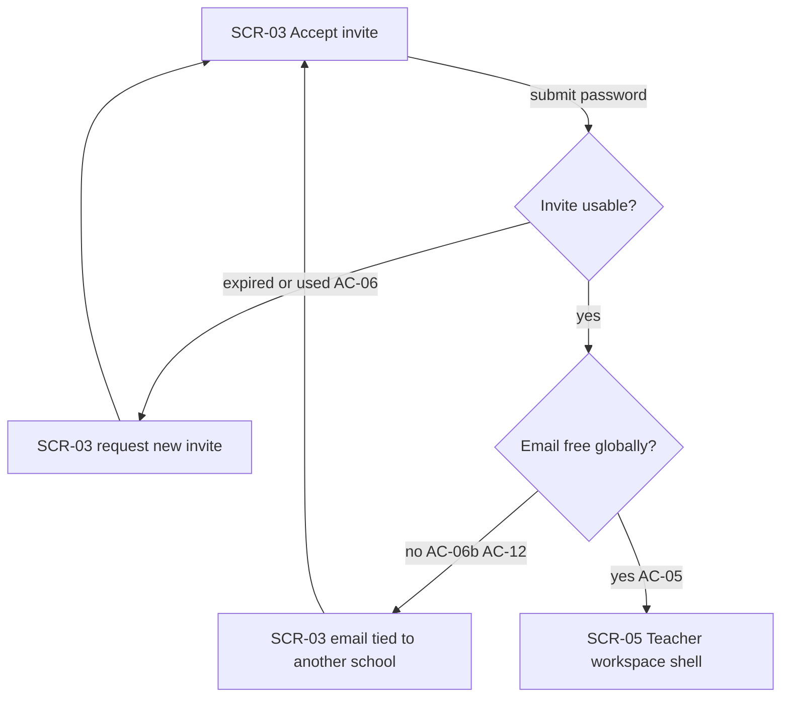
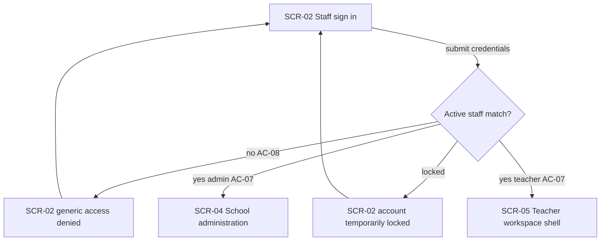
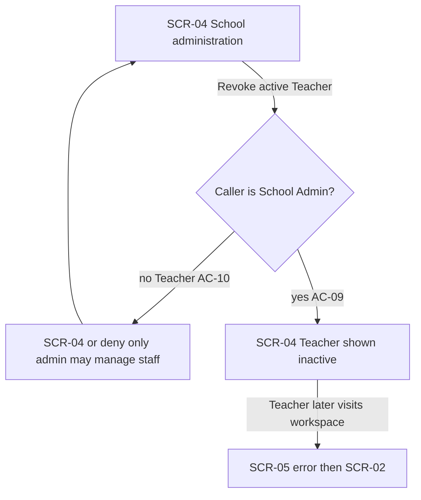
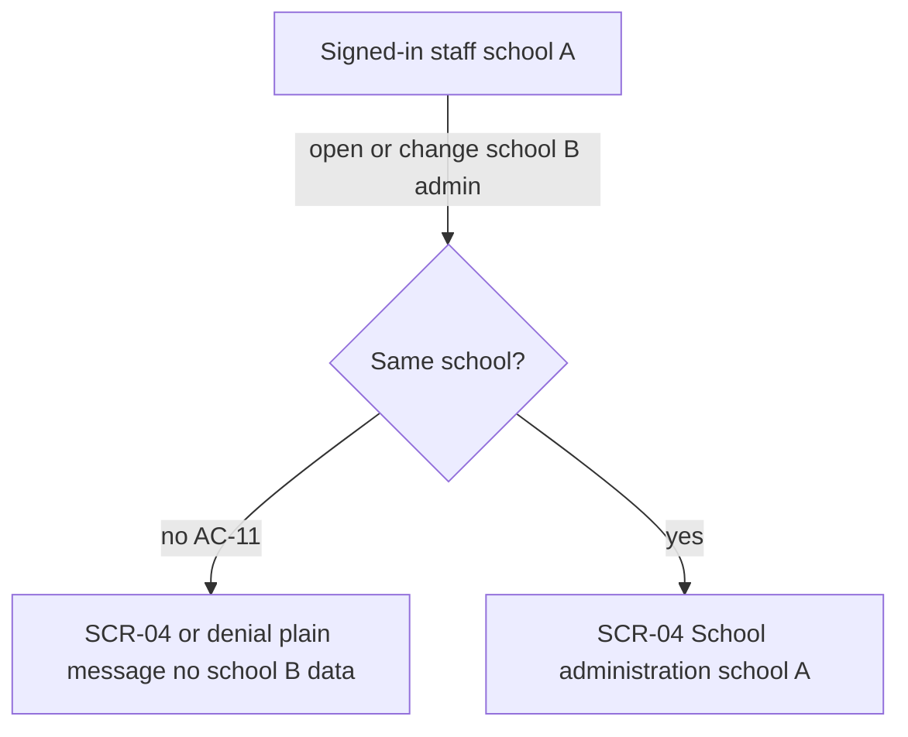

# UX flows — school-auth

> User flows for every UI-touching §4 user story, produced by `ux-flows` (after `clarify`, before
> `design`) and read by `design` (evidence for the target-surface + UI-architecture decisions),
> `sequences` (UI-driven flows align on SCR ids), `screens` (details every inventory row) and
> `plan-tests` (the e2e-through-UI paths). **Always markdown + mermaid `flowchart`**, whatever the
> design tool — this artifact is flow-altitude, not visual design.
>
> **Backfill note:** `design` / `screens` / `tasks` already ran for this feature; SCR-01…05 match
> `screens.md`. This file closes the inventory-gap those stages noted.

## Platform decisions

- **Posture:** desktop-first responsive — staff web (School Admin roster + Teacher shell) assumes laptop/desktop first; usable on tablet. No `docs/design-system.md` yet (code-mode assumption; recommend `/sdd:design-system`).
- **Navigation:** page-based App Router routes (public auth pages vs authenticated admin/teacher shells); no multi-step wizards beyond single-form screens.
- **Modality:** invite / revoke / reissue happen on the school-administration page (inline), not separate modal-only flows at this altitude.
- **Design input (not decided here):** hybrid SSR/cookie sessions already chosen in SAD/ADRs — flows assume redirects after success.

## Screen inventory

| ID | Screen | Purpose | Entry | Exit |
|---|---|---|---|---|
| SCR-01 | Register school | Prospective School Admin creates tenant + admin account | Public URL / link from sign-in | Success → SCR-04; or stay on SCR-01 on error |
| SCR-02 | Staff sign in | Returning School Admin or Teacher authenticates | Public URL / link from register | Success → SCR-04 or SCR-05 by role; stay on SCR-02 on deny/lock |
| SCR-03 | Accept invite | Invitee sets password and joins school as Teacher | Invite email link with token | Success → SCR-05; stay on SCR-03 on error |
| SCR-04 | School administration | School Admin roster, invite, reissue, revoke | After register/sign-in as admin | Sign-out → SCR-02; Teacher workspace N/A |
| SCR-05 | Teacher workspace shell | Teacher post-auth landing (journal later) | After accept/sign-in as Teacher | Sign-out → SCR-02; revoked → SCR-02 |

## Flows

### Flow: US-01 — Register school

**Prose:** A prospective School Admin opens Register school (SCR-01), enters school display name, work email, and password, and submits. If anything is missing/invalid or the password is too short, they stay on SCR-01 with corrections named (AC-02). If the display name is already taken, they stay on SCR-01 with a clear “name in use” message (AC-02b). On success the tenant and School Admin account exist and they land in School administration (SCR-04) (AC-01).

### Flow: US-02 — Invite teacher

**Prose:** A signed-in School Admin on School administration (SCR-04) invites a Teacher by work email. If that email is already pending or active at the school, the invite is blocked with an explanation and the admin stays on SCR-04 (AC-04). Otherwise a pending invite appears on the roster (AC-03). From a pending or expired row, Reissue creates a new pending invite and invalidates the prior one; the roster shows the new pending state (AC-13).

### Flow: US-03 — Accept invite

**Prose:** A Teacher opens the invite link on Accept invite (SCR-03) and chooses a password. If the invite is expired or already used, setup is blocked and they are told to ask their School Admin for a new invite (AC-06). If their work email is already active staff at another school, activation is blocked with that explanation (AC-06b / AC-12). On success they become a Teacher for that school only and open the Teacher workspace shell (SCR-05) (AC-05).

### Flow: US-04 — Staff sign in

**Prose:** A School Admin or Teacher opens Staff sign in (SCR-02) and submits credentials. If credentials do not match active staff, access is denied with a generic message that does not reveal other-school email existence (AC-08). If the account is temporarily locked after failed attempts, they see a lock message and stay on SCR-02. On success, School Admins go to School administration (SCR-04) and Teachers to the Teacher workspace shell (SCR-05), for their school only (AC-07).

### Flow: US-05 — Manage staff access

**Prose:** On School administration (SCR-04), the School Admin revokes an active Teacher. The roster shows that Teacher as inactive, and that Teacher cannot open the teacher workspace on later visits (session/access fails toward sign-in) (AC-09). If a Teacher tries to invite or revoke, the system denies the action and explains that only the School Admin may manage staff (AC-10).

### Flow: US-06 — Protect school boundary

**Prose:** Signed-in staff belonging to school A who try to view or change administration for school B are denied with a plain-language message and see no school B data (AC-11). Cross-school invite completion (AC-12) is covered on the Accept invite flow (US-03), not redrawn here.

## Out of scope (non-UI or deferred)

- None of the §4 stories are backend-only; all six touch staff web. Student/parent/mobile surfaces remain product non-goals for this feature (spec §3).

## AC coverage

| AC | Shown by | Notes |
|---|---|---|
| AC-01 | Flow US-01 → success to SCR-04 | Happy register |
| AC-02 | Flow US-01 → invalid input branch | Stay SCR-01 |
| AC-02b | Flow US-01 → name taken branch | Stay SCR-01 |
| AC-03 | Flow US-02 → pending on roster | SCR-04 |
| AC-04 | Flow US-02 → duplicate blocked | SCR-04 |
| AC-05 | Flow US-03 → success to SCR-05 | Accept invite |
| AC-06 | Flow US-03 → expired/used branch | Stay SCR-03 |
| AC-06b | Flow US-03 → email elsewhere branch | Stay SCR-03 |
| AC-07 | Flow US-04 → role redirect SCR-04/SCR-05 | Sign in |
| AC-08 | Flow US-04 → generic deny | Stay SCR-02 |
| AC-09 | Flow US-05 → inactive + later workspace deny | SCR-04 / SCR-05→SCR-02 |
| AC-10 | Flow US-05 → Teacher forbidden manage | Deny on SCR-04 path |
| AC-11 | Flow US-06 → cross-school deny | No school B data |
| AC-12 | Flow US-03 → email elsewhere branch | Same UI as AC-06b |
| AC-13 | Flow US-02 → reissue branch | SCR-04 new pending |
