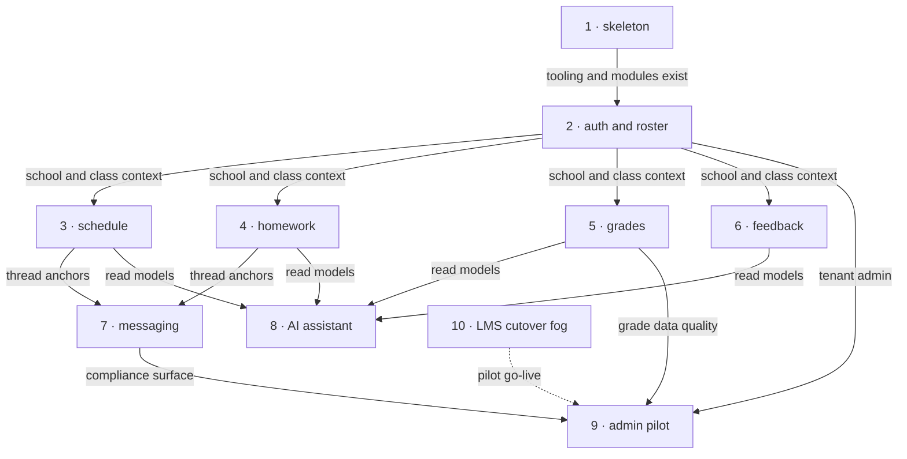

# Roadmap — schoolo

> **A decomposition, not a promise.** The overall idea broken into incremental steps: what each
> step is, where it comes from, how big it is — or that nobody has looked at it yet — and in which
> order, and parallel lanes, we walk them. **No dates** (except shipped history), **no scores** —
> order is the prioritization. The *solution* for any step lives in its `docs/features/<slug>/`
> spec, not here.

## Destination

A mandatory school runs its official journal in schoolo: teachers enter schedule, homework, grades, and feedback on web; students rely on the mobile app for the same data plus structured teacher communication; non-authoritative AI and parent premium layers follow once that core data is trustworthy.

## Steps

| # | Step | Source | Size | Status |
|---:|---|---|:---:|---|
| 1 | Materialize project skeleton | `architecture-map.md` — Stack | S | shipped |
| 2 | School auth, tenancy, and roster | `idea-brief.md` — `## 7. Recommendation` | M | idea |
| 3 | Schedule end-to-end (teacher web + student mobile) | `idea-brief.md` — `## 1. Raw idea` | M | idea |
| 4 | Homework end-to-end (teacher web + student mobile) | `idea-brief.md` — `## 2. Problem` | M | idea |
| 5 | Grades end-to-end (teacher web + student mobile) | `idea-brief.md` — `## 1. Raw idea` | M | idea |
| 6 | Teacher feedback records | `idea-brief.md` — `## 1. Raw idea` | S | idea |
| 7 | Structured async messaging | `idea-brief.md` — `## 5. Out of scope` | L | idea |
| 8 | AI assistant (summaries, trends, tips, motivation) | `idea-brief.md` — `## 7. Recommendation` | L | idea |
| 9 | Admin pilot metrics and compliance visibility | `idea-brief.md` — `## 7. Recommendation` | M | idea |
| 10 | Incumbent LMS cutover → see [Not yet specified](#not-yet-specified) | `idea-brief.md` — `## 8. Open questions` | fog | idea |
| 11 | Parent premium with AI progress → see [Not yet specified](#not-yet-specified) | `idea-brief.md` — `## 8. Open questions` | fog | idea |

## Not yet specified

| Area | What we'd have to learn | Blocks | How it gets sharpened |
|---|---|:---:|---|
| Incumbent LMS cutover | Which LMS the pilot replaces, required parity fields, import or dual-write strategy, and rollback if teachers dual-enter | 10 | Recon with the pilot school plus a parity checklist; may become one or more sized steps after `/sdd:specify lms-migration` |
| Parent premium offering | Pricing, consent, whether it ships with the big-bang pilot, and how it relates to the no free parent portal v1 choice | 11 | Product and legal grilling; prototype only if billing and child-data flow are unclear |

## Out of scope

- **Food menu** — canteen integrations are not journal core (`idea-brief.md` — `## 5. Out of scope`).
- **Standalone diary product pillar in v1** — may merge with schedule and homework day view later (`idea-brief.md` — `## 5. Out of scope`).
- **Open messenger-style teacher DM** — v1 uses structured async threads only (`idea-brief.md` — `## 5. Out of scope`).
- **AI changing official grades** — assistant-only posture (`idea-brief.md` — `## 5. Out of scope`).

## Open decisions

| # | Question | Type | Owner | Blocks |
|---:|---|:---:|:---:|---|
| D1 | Which incumbent LMS must the first pilot replace, and what is the minimum parity set? | grilling | human | 10 |
| D2 | Does parent premium launch with the pilot or only after teacher compliance targets are met? | grilling | human | 11 |
| D3 | Is “diary” a distinct UX or the schedule plus homework day view? | grilling | human | — |
| D4 | Which geography governs chat retention and parent or child AI data rules? | grilling | human | 7, 8, 11 |

## Decisions so far

- TypeScript monorepo with Fastify API, Next.js web, Expo mobile, shared Zod types → [`docs/adr/0001-monorepo-and-typescript-stack.md`](docs/adr/0001-monorepo-and-typescript-stack.md)
- Hexagonal modules per bounded context in the API → [`docs/adr/0002-hexagonal-module-layout.md`](docs/adr/0002-hexagonal-module-layout.md)
- PostgreSQL with Prisma migrations and ULID ids → [`docs/adr/0003-postgresql-prisma-persistence.md`](docs/adr/0003-postgresql-prisma-persistence.md)
- v1 journal core without food menu; student mobile plus teacher web write path → [`docs/idea-brief.md`](docs/idea-brief.md) (`## 7. Recommendation`)

## Dependency graph

## Execution path

| Wave | Steps | Zone per step (why parallel-safe) | Unlocks |
|:---:|---|---|---|
| 1 | 1 | monorepo root `(new)` | 2 |
| 2 | 2 | `apps/api/src/modules/schools`, `users` `(new)` | 3, 4, 5, 6, 9 |
| 3 | 3 ∥ 4 ∥ 6 | 3: `schedule` `(new)` · 4: `homework` `(new)` · 6: `feedback` `(new)` | 5, 7, 8 |
| 4 | 5 | `grades` `(new)` | 8, 9 |
| 5 | 7 | `messages` `(new)` | 9 |
| 6 | 8 | `apps/api` AI module `(new)` plus mobile and web surfaces | — |
| 7 | 9 | `apps/web` admin `(new)` | pilot measurement |

Steps **10** and **11** (`fog`) are excluded from waves until `## Not yet specified` areas are sharpened and sizes assigned.

## Shipped

| Step | Shipped | Link |
|---|---|---|
| Materialize project skeleton | 2026-10-03 | (local commit — scaffold) |
